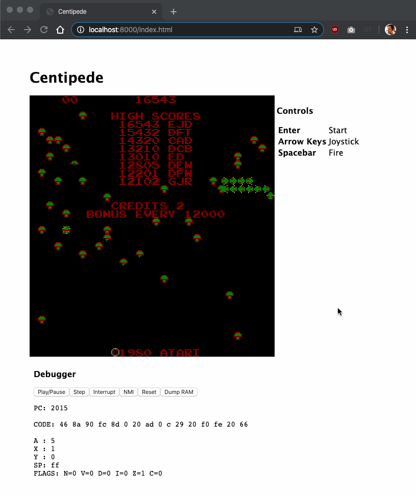

# Retro Arcade: Centipede

Your mission is to get the classic arcade game _Centipede_ bootstrapped inside of a web browser. 

When you prevail, the result will look something like this:

This may sound like a huge task. Certainly designing the original arcade game was a big project, and even 20 years ago building an emulator for this from scratch might take weeks or months. 

Today, we have the internet, multiple working implementations in the open source corpus to refer to, Javascript CPU emulators that [simply fall from the sky](https://github.com/DrGoldfire/MOS6502.js), and web browsers that execute Javascript absurdly efficiently. This task is not so big anymore.

The purpose of this exercise is to simulate many aspects of real-world work. You will be asked to

* Work with a legacy system
* Perform some reverse engineering
* Debug and work in an imperfect environment
* Work with imperfect source material/documentation
* Research and learn from the internet 
* Confront low-level details -- bits, bytes, memory mapped I/O, graphics, etc.
* Deal with some really large components (instantiating a CPU in a one-liner) as well as some really dense details (parsing palettes and rendering sprites)
* Get across some annoying roadblocks
* Have some fun, and learn some new things

We had a lot of fun building a reference implementation for this project, and we think you'll have a lot of fun completing this challenge. There will be moments of despair, but there are also a few satisfying [black triangles](https://philosophistry.com/archives/2009/01/what-is-a-black.html) as you get this working, and you'll learn some new things and develop a few new skills along the way. 

## Requirements

* Centipede boots up in the web browser and is playable for player 1
* Render the screen using an HTML5 `<canvas>` element
* Use the 6502 emulator mentioned in the references section to emulate the main CPU.
* Deliver this as a directory of static files with an `index.html` that we can load
* Feel free to use the internet as a resource, but write your own code, do not consult others, do not share code with other candidates, do not plagiarize.
* Do not publish your work on the internet.

## Non-requirements

* Making the web page pretty
* Making the web page compatible with a wide range of browsers (we'll test with the latest Chrome browser)
* Doing anything with sound or audio
* Doing anything with non-volatile storage
* Making the framerate perfect, or the emulation cycle-accurate. 
* The "debugger" in the screenshot (though you may want to for your own benefit 😀)

## References

While developing the reference implementation for this project, we found the following references useful:

* Use [this excellent 6502 emulator](https://github.com/DrGoldfire/MOS6502.js). It worked great for us.
* The [MAME](https://www.mamedev.org/) source code. This contains detailed information about the Centipede hardware, memory map, I/O, etc.
 - For best results, check it out and load it up in your favorite code editing environment that supports full multi-file searching, or get comfy with [ripgrep](https://github.com/BurntSushi/ripgrep).
* [Centipede in JavaScript by Static Binary Translation](http://members.aon.at/nkehrer/centipede_js.html)
 - Use this as a reference for accurate emulation
 - Feel free to "view source" on this thing and poke around. Don't plagiarize, but feel free to use it to answer questions and resolve ambiguities.
* [6502 instruction set reference](https://www.masswerk.at/6502/6502_instruction_set.html)
 - You may need to understand some of the CPU instructions when things go wrong. We had to use this about three times while building the reference implementation.

## Getting Started

For the purpose of this project, the centipede arcade game is built out of a few components:

* A 6502 CPU
* 16KiB of RAM
* 8KiB of program ROM
* 4KiB of graphics ROM
* A graphics co-processor that displays [sprites](https://en.wikipedia.org/wiki/Sprite_(computer_graphics)) on the screen
* A [POKEY](https://en.wikipedia.org/wiki/POKEY) chip that implements audio (ignore this) and random number generation (do not ignore this)

The 6502 CPU is extremely simple. It addresses memory, executes instructions, and two interrupt lines--IRQ and NMI (which is unused in this project. All input and output uses [Memory Mapped I/O](https://en.wikipedia.org/wiki/Memory-mapped_I/O). A memory map, sourced from [here](https://github.com/mamedev/mame/blob/master/src/mame/drivers/centiped.cpp) is included in this package as `memorymap.txt`.

We recommend that you start by implementing the memory read/write hooks according to the `memorymap.txt` package, then attempting to boot the CPU using `MOS6502.js`.

It is very worthwhile to read and understand the MAME driver for `centiped`. This will provide crucial information about the clock speed of the CPU, how the I/O ports are laid out, how screen refresh works, and so on.

Once you think you have the game executing with no display, dump the contents of main memory or the registers to confirm that it looks like it is running. It may not be running well yet, but this is a good moment for a sanity check.

Then you will build the display routines. This is the most detail-intensive part of the project. We had the best luck working out these details by reverse-engineering _Centipede in Javascript by Binary Translation_. You could also learn how this is done from the MAME source code.

At this point, you'll (hopefully) have the title screen loading and animating properly, so hook up the keyboard controls and see how it works.

We found both the MAME code and _Centipede in Javascript by Binary Translation_ to be valuable sources of information. The MAME emulation is very comprehensive and clear, but it is very comprehensive and generalized across hundreds of arcade games, which can sometimes make it more difficult to read. The web-based implementation provides good information on the _minimum_ set of stuff that is needed to boot up this game and make it playable and can help you focus on the right areas to get this up and running.

Good luck!

## Included in this package

* A sample `index.html` with a canvas element of the right size
* ROMs from the arcade console.

## How we will test this

We want to see your code and review it. Please make sure it is presentable.

To test the game, we will launch a simple static file webserver in the directory you deliver to us like this:

    $ python3 -m http.server 8000

And then navigate to `http://localhost:8000`

## Our experience building this

One developer was able to build a reference implementation that met these requirements in about 6 hours of focused attention. This included extra items like finding all of the above references, choosing a 6502 module, and evaluating multiple retro arcade games for suitability. 

The process included a few moments of feeling "stuck" when things weren't working, but all of them were surmountable using the references above and some debugging attention. Don't be discouraged--there is a pathway to the end. You will get it working.

This resulted in the HTML file included in this package plus approximately [300 SLOC](https://www.npmjs.com/package/sloc) of javascript. 

Be wary if your solution is getting much larger than this, and don't hesitate to reach out for help.

