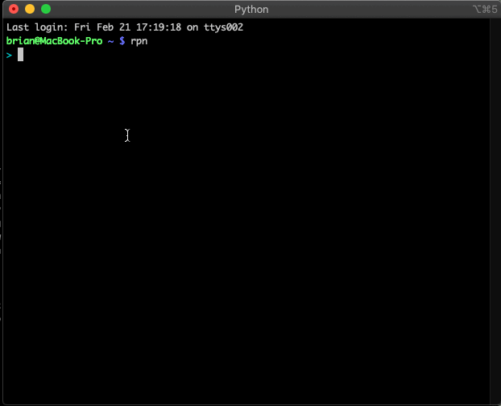

# Reverse Polish Notation

The objective in this project is to build a complete, polished, but _small_ product: A 
[reverse polish notation calculator](https://en.wikipedia.org/wiki/Reverse_Polish_notation) in the style of a unix command line tool.

When you prevail, the result will look something like this:

The purpose of this exercise is to simulate many aspects of real-world work. You will be asked to

* Design and build a small product 
* Show awareness of unix command line culture, convention, and user expectations
* Support interactive use cases as well as programmatic use cases involving pipelines and redirection
* Think through human-computer-interface concerns and make a tool that is pleasant, intuitive, and flexible
* Deliver something at a reasonably high degree of polish
* Have some fun, and learn some new things

If you do this project well, you'll be happy to make this program a part of your permanent toolbox. 

**We have seen several submissions that focus solely the calculator implementation, without addressing the main points of this exercise as described above. Please do not spend your time doing this without paying attention to human factors and unix interoperability--we will not accept it.**

We had a lot of fun building a reference implementation for this project, and we think you'll have a lot of fun completing this challenge. 

## Requirements

* An command line tool called `rpn` written in the programming language of your choice
* The command line tool should operate like other unix command line tools.
* Package it so it can be easily built/run on common unix systems (linux, mac os x)
* Feel free to use the internet as a resource, but write your own code, do not consult others, do not share code with other candidates, do not plagiarize.
* Do not publish your work on the internet.

## References

While developing the reference implementation for this project, we found the following references useful:

* [Wikipedia: Reverse Polish Notation](https://en.wikipedia.org/wiki/Reverse_Polish_notation)
* [RPN Tutorial](https://hansklav.home.xs4all.nl/rpn/)

## Getting started

You can use any language that you like for this project, so you'll want to start by picking something that you are comfortable with. Try to choose
a langauge that won't struggle to make a command line app that is at home in unix environments.

Since product design is a significant part of this project, we expect a fair bit of variation in the details and the command set. We've provided 
examples of the help screens in our reference implementation to give a sense of the scope of functionality we are looking for. 

While building this, think about what happens in expected (and unexpected) error situations. Also, give thought to how this tool might be used 
in pipelines, as a filter in popular unix text editors, interactively, in a shell script, etc.

Finally, spend some time testing the tool in all of the various situations. Put yourself in the shoes of different kinds of unix users
and make sure it behaves well when pushed in the ways that all of them would push it.

For example, a programmer working on a low level project might expect binary and hex input/output:

    $ rpn
    > bin
    > 0xaa55
    0b1010101001010101 > 2 |
    0b1010101001010111 > 1 ~ &
    0b1010101001010110 >

And someone interested in factorials may expect more than the usual level of precision:

    $ rpn
    > 50 fact
    30414093201713378043612608166064768844377641568960512000000000000 >

These are just a couple of examples. An end user should expect to fumble around with this tool and be pleasantly surprised when things "just work".

## Example: Command Line Help

This is the command line help from our reference implementation:

    USAGE:

      rpn                          Launch in interactive mode
      rpn [expression]             Evaluate a one-line expression

    RC FILE

      rpn will execute the contents of ~/.rpnrc at startup if it exists.

    EXAMPLES

      rpn 1 2 + 3 + 4 + 5 +              => 15
      rpn pi cos                         => -1.0
      rpn                                => interactive mode

## Example: Command Set Help

For our reference implementation we built the following commands. We consider this to be a relatively complete set of 
functionality:

    Arithmetic Operators

      +          Add
      -          Subtract
      *          Multiply
      /          Divide
      cla        Clear the stack and variables
      clr        Clear the stack
      clv        Clear the variables
      !          Boolean NOT
      !=         Not equal to
      %          Modulus
      ++         Increment
      --         Decrement

    Bitwise Operators

      &          Bitwise AND
      |          Bitwise OR
      ^          Bitwise XOR
      ~          Bitwise NOT
      <<         Bitwise shift left
      >>         Bitwise shift right

    Boolean Operators

      &&         Boolean AND
      ||         Boolean OR
      ^^         Boolean XOR

    Comparison Operators

      <          Less than
      <=         Less than or equal to
      ==         Equal to
      >          Greater than
      >=         Greater than or equal to

    Trigonometric Functions

      acos       Arc Cosine
      asin       Arc Sine
      atan       Arc Tangent
      cos        Cosine
      cosh       Hyperbolic Cosine
      sin        Sine
      sinh       Hyperbolic Sine
      tanh       Hyperbolic tangent

    Numeric Utilities

      ceil       Ceiling
      floor      Floor
      round      Round
      ip         Integer part
      fp         Floating part
      sign       Push -1, 0, or 0 depending on the sign
      abs        Absolute value
      max        Max
      min        Min

    Display Modes

      hex        Switch display mode to hexadecimal
      dec        Switch display mode to decimal (default)
      bin        Switch display mode to binary
      oct        Switch display mode to octal

    Constants

      e          Push e
      pi         Push Pi
      rand       Generate a random number

    Mathematic Functions

      exp        Exponentiation
      fact       Factorial
      sqrt       Square Root
      ln         Natural Logarithm
      log        Logarithm
      pow        Raise a number to a power

    Networking

      hnl        Host to network long
      hns        Host to network short
      nhl        Network to host long
      nhs        Network to host short

    Stack Manipulation

      pick       Pick the -n'th item from the stack
      repeat     Repeat an operation n times, e.g. '3 repeat +'
      depth      Push the current stack depth
      drop       Drops the top item from the stack
      dropn      Drops n items from the stack
      dup        Duplicates the top stack item
      dupn       Duplicates the top n stack items in order
      roll       Roll the stack upwards by n
      rolld      Roll the stack downwards by n
      stack      Toggles stack display from horizontal to vertical
      swap       Swap the top 2 stack items

    Macros and Variables

      macro      Defines a macro, e.g. 'macro kib 1024 *'
      x=         Assigns a variable, e.g. '1024 x='

    Other

      help       Print the help message
      exit       Exit the calculator

## How we will test this

We want to see your code and review it. Please make sure it is presentable.

We will build your tool according to the instructions that you provide us, and then install/run it, just like an end user would.

We are going to make sure that this tool is a pleasure to use:

* Interactively
* For "one shot" computations
* In pipelines

We are going to look for attention to polish and creature comforts. A good help function, nice looking console displays, a nice interactive mode, etc. 
It should be a pleasure to use, and should not feel like a toy.

## Our experience building this

One developer was able to build a reference implementation that met these requirements in about 4 hours of focused attention. This resulted in about 
[350 SLOC](https://www.npmjs.com/package/sloc) of python. 

Many people could get a basic four-function calculator working in a few minutes, so this may seem like lot of time for a simple project. The bulk of 
the time was spent fleshing out the user experience details that make this great, sweating the edge cases, and testing the various situations in which 
a unix user would expect for this tool to work.

