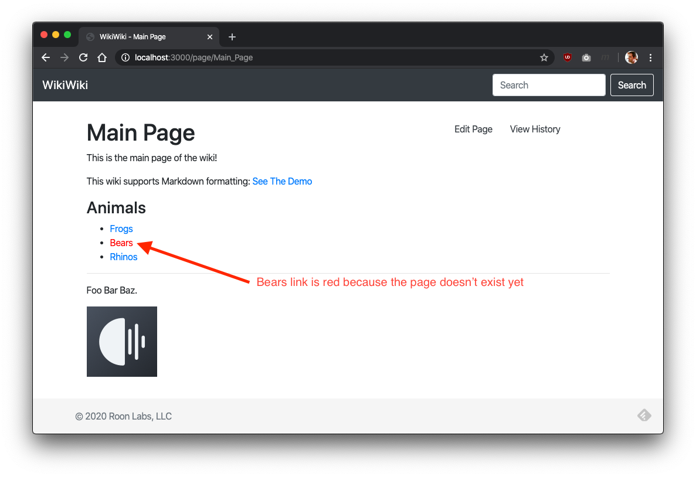
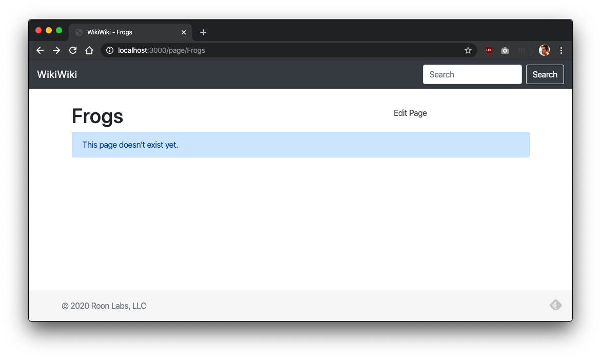
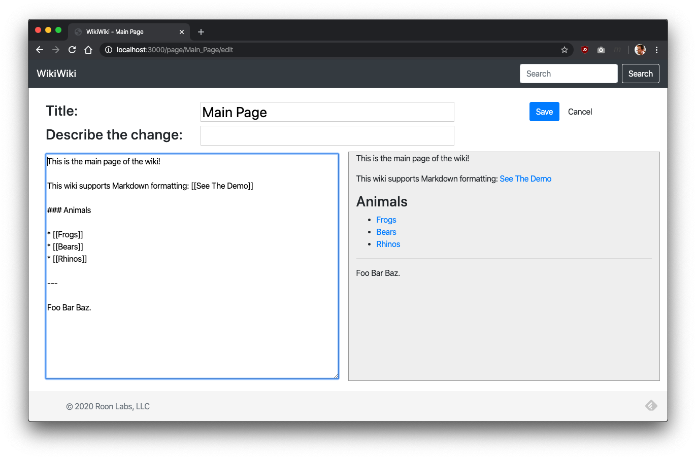
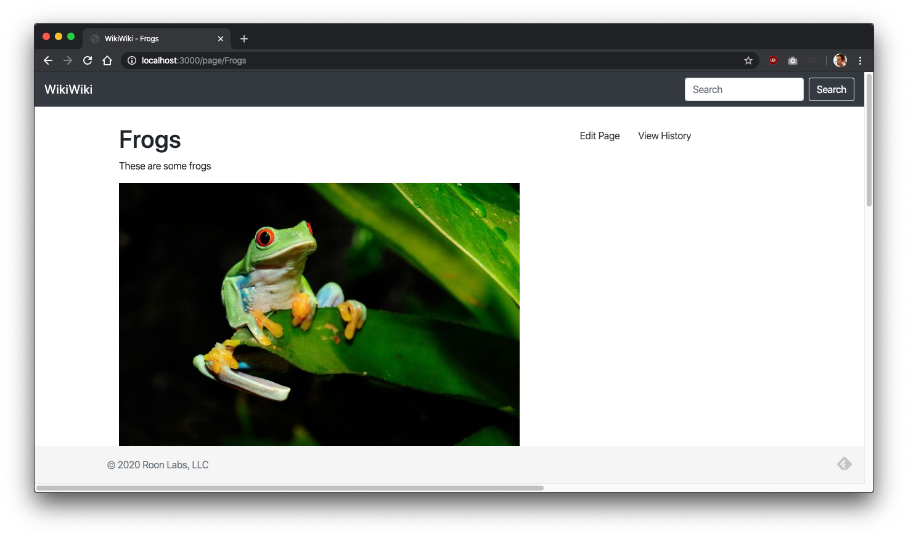
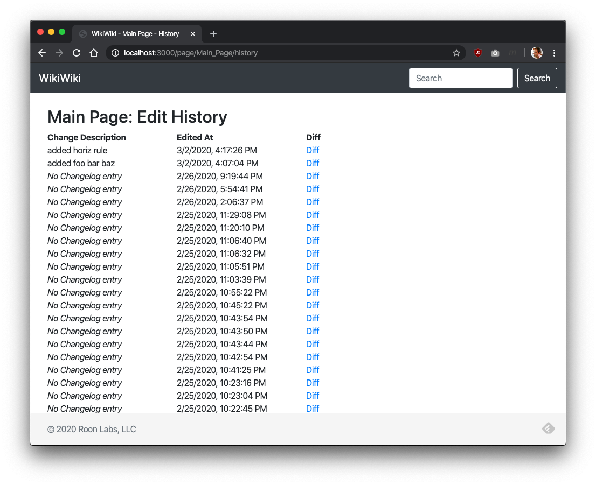
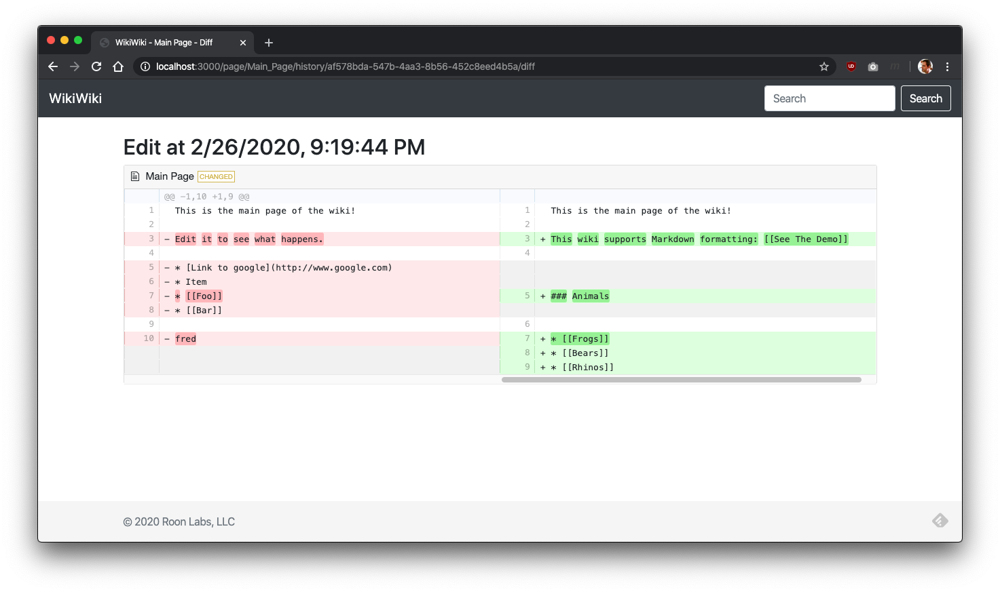
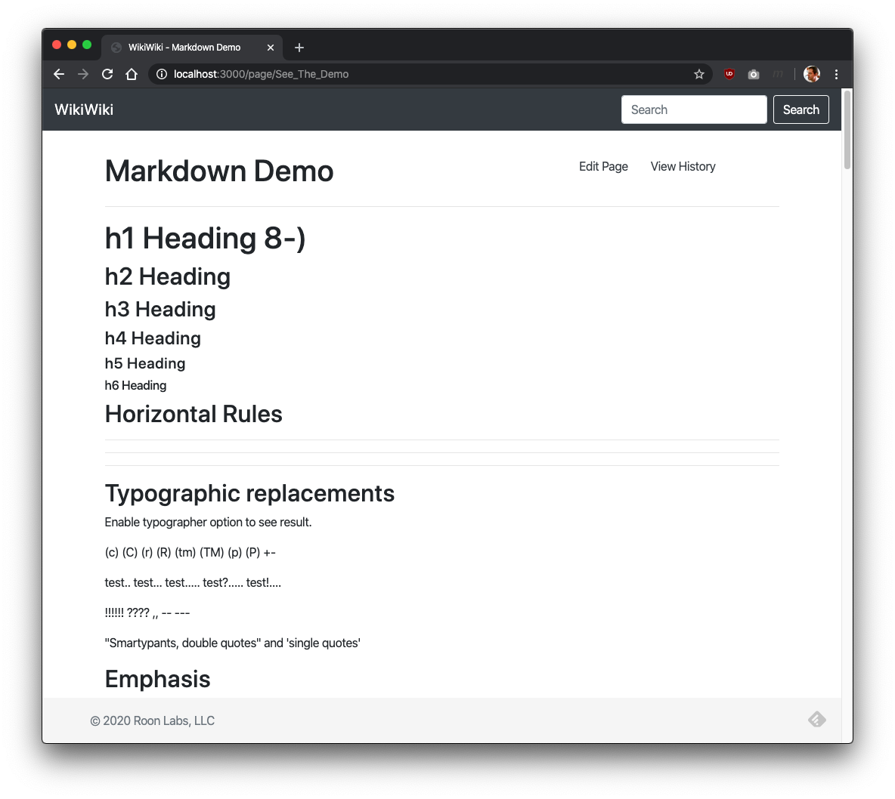

# Wiki

Your mission is to build a simple and functional personal wiki engine using modern web development and devops tools. 

The purpose of this exercise is to simulate many aspects of real-world web development work in a culture like ours.

While we built a reference implementation as a toy just for the purpose of this challenge, our [Knowledge Base](https://kb.roonlabs.com) runs on a similar wiki engine 
that was developed in about a day by one developer. In a company like Roon Labs, we often have to rapidly spin up home-grown internal tools like this one and then use them 
heavily for months or years with minimal rework.

You will be asked to:

* Demonstrate "full stack" web development skills
* Build a functional (but not pretty) web-based UI
* Select and leverage ready-made open-source components to build an app efficiently
* Work with standard tooling in a node.js environment 
* Package your work for easy and repeatable deployment
* Demonstrate that you are able to delver a project that is fast to build, cheap to build, and _good enough_.

For this project, pretend that you have been tasked with building this as an tool for the company to use internally. The goal isn't to over-engineer 
or over-design to perfection and make a beautiful end result--it's to make practical choices that get this tool up and running quickly without getting 
too lost in menutia or polish.

We had a lot of fun building a reference implementation for this project, and we think you'll have a lot of fun completing this challenge.

## Requirements

* Use node.js
* Use an embedded database like [sqlite](https://www.npmjs.com/package/sqlite3).
* Design the app to perform reasonably for up to a few thousand wiki pages and modest viewer traffic.
* Support the following functionality:
 - Wiki Browsing
  * Displaying wiki pages
  * Navigating [[Wiki Links]] between wiki pages
  * Display "broken" wiki links in a different color than "working" links.
 - Editing
  * Support live preview of [markdown](https://github.com/adam-p/markdown-here/wiki/Markdown-Cheatsheet) rendering during editing
  * Support for uploading images to include in a wiki page
 - Edit History
  * For each wiki page, display a list of edits with a changelog entry + when
  * Provide a graphical diff viewer that shows what was changed.
 - Implement full-text search of the wiki pages.
* See the tour below for an idea of what a complete product looks like. 

## Non-requirements

* Handling user accounts
* Making this service scalable
* Making this service highly available
* Making the design beautiful
* Making the web page compatible with a wide range of older browsers (we will test with current Chrome)

## How we will test this

We want to see your code and review it. Please make sure it is presentable.

Please package your code into a compressed archive and include a README.md that explains how to launch it + load it in a web browser. 

In many cases this will look like:

    $ npm install
    $ npm start
    $ open http://localhost:3000

## Reference implementation tour

These are the screens that we built for the reference implementation:

### Main Page. 

This is an editable wiki page like any other.

### Editing

If you follow a nonexistant `[[WikiLink]]` it takes you to a page that has no content. 

This page can be edited:

To create a real page with content:

### Edit History

### Markdown Demo 

(From [here](https://markdown-it.github.io/))

## Our experience building this

One developer was able to build a reference implementation that met these requirements in about 4 hours of focused attention.

If you feel this project growing to an unreasonable size, consider whether you are spending your time shrewdly enough. 

The key to accomplishing so much in a short time is to cut the right corners (for example, don't get lost on scalability or graphics), and to avoid implementing _anything_ from scratch 
by leveraging the Node.js ecosystem. There are some large-sounding items in the requirements like the full-text search and the graphical diff functionality, but both can be accomplished 
in very little time using off-the-shelf packages. In particular with search, consider that this wiki only needs to scale to thousands of documents, not millions. 

Don't spend too much time on graphics. We strongly recommend using something like [Bootstrap](https://getbootstrap.com/docs/4.0/getting-started/introduction/) to keep yourself 
moving quickly. Avoid the temptation to overdo small details. 

